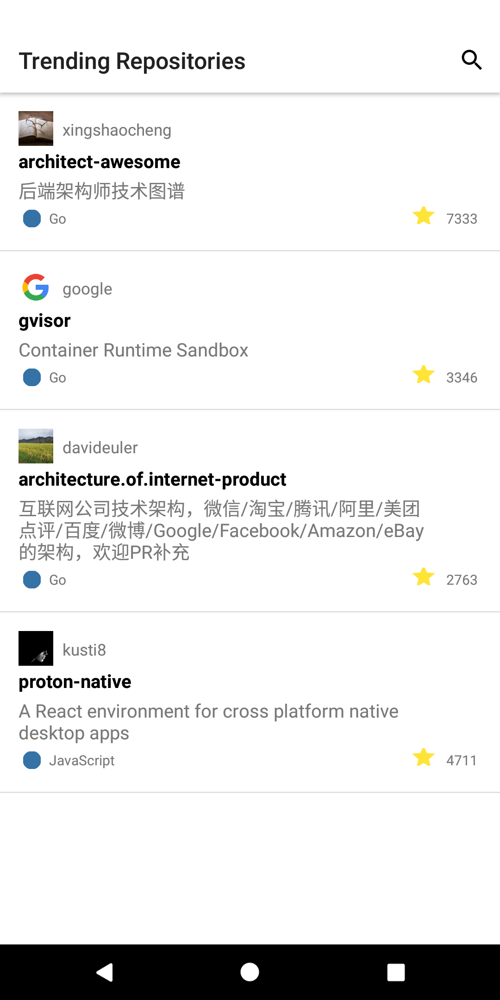
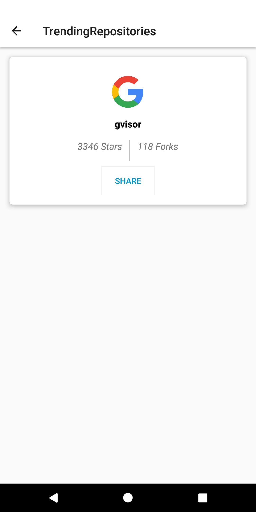
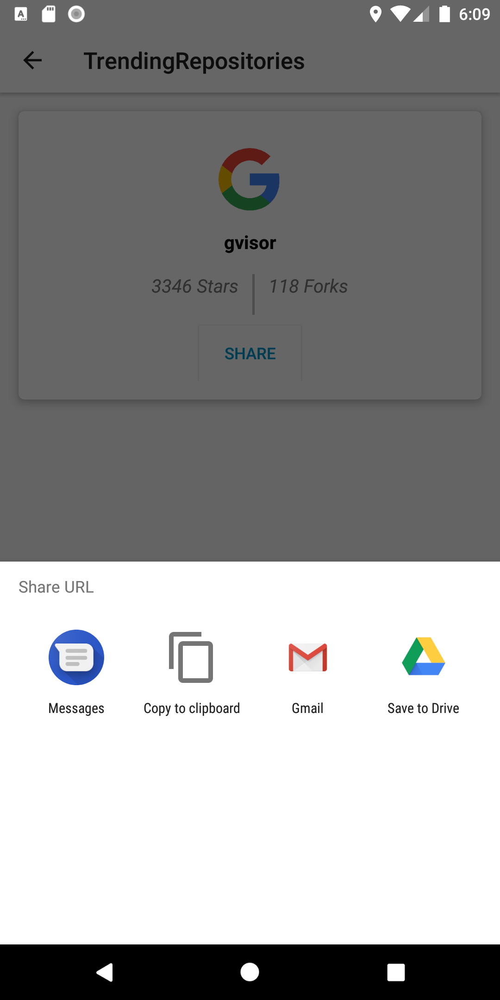
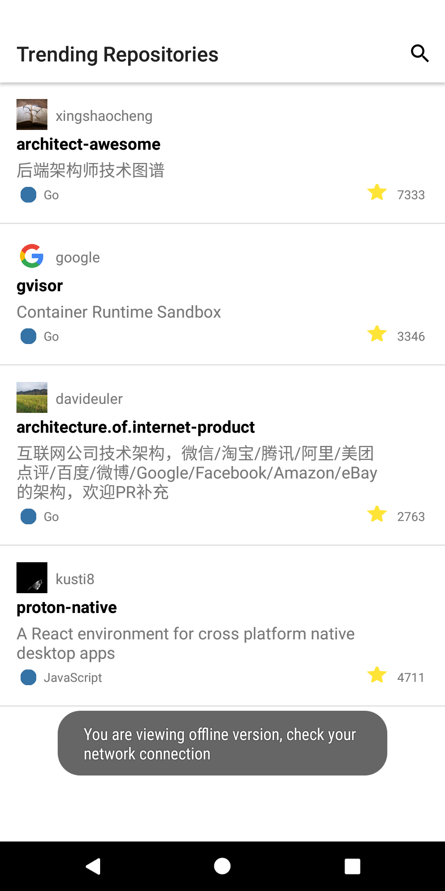
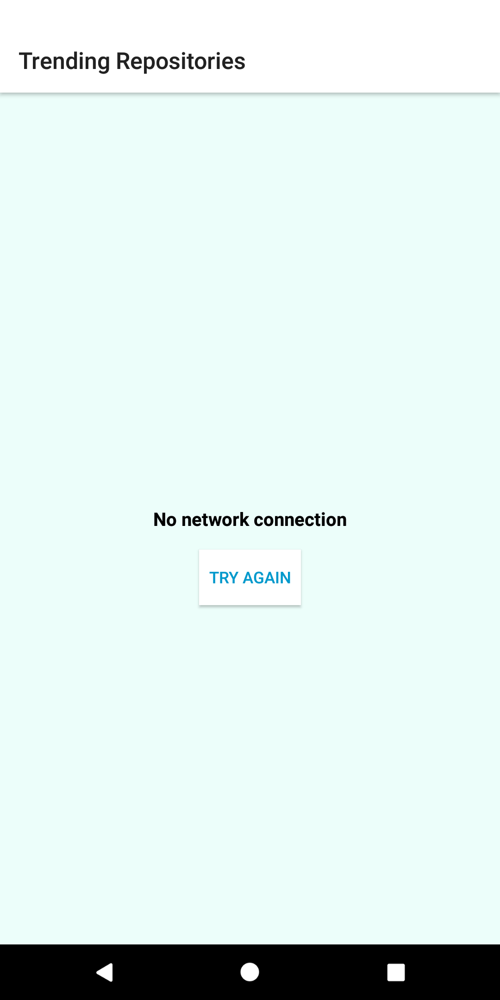
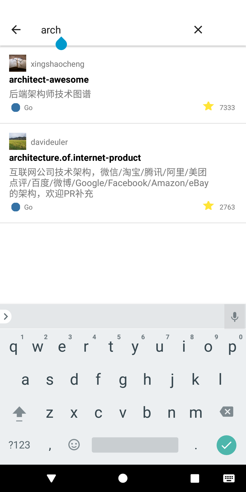
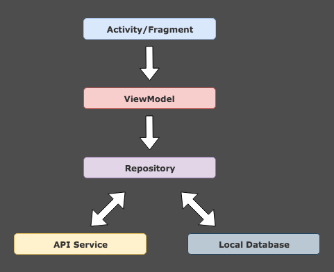

# GithubTrending
An Android App that lists the most trending repositories from Github.If the app is freshly installed, then there will not be any data stored inside the local database. because there is no data to show, a loading progress bar UI will be shown. Meanwhile the app is going to make a request call to the server via a web service to get all the repository list.
If the response is unsuccessful then the error message UI will be shown with the ability to retry a call by pull refresh, When a request call is successful at last, then the response data will be saved to a local database, if your network goes off data will be loaded from cache.

    
 

<b>App Features</b>
<ul>
<li>Users can view the most trending repositories from Github.</li>
<li>Users can search repositories.</li>
<li>Pull to refresh option to force fetch repositories from remote.</li>
<li>Offline Support</li>
<li>Users can share repositories they like.</li>
<li>Product flavor Dev- Mock Server- https://private-efbf4-githubtrendingapi.apiary-mock.com/  Prod - Production Server - https://ghapi.huchen.dev/ (not working)</li>
</ul>

<b>App Architecture</b>

Based on mvvm architecture and repository pattern.

<b>The app includes the following main components:<b>
<ul>
<li>Persistence Folder - Room database that servers as a single source of truth for data presented to the user.</li>
<li>NetworkManger - Used to fetch api service.</li>
<li>GitHubTrendingRepositories- A repository that works with the database and the api service, providing a unified data interface.</li>
<li>RepositoryListViewModel- A ViewModel that provides data specific for the UI.</li>
<li>View Folder- The UI, which shows a visual representation of the data in the ViewModel.</li>
</ul>

<b>App Specs</b>
<ul>
<li>Minimum SDK 21</li>
<li>Java8</li>
<li>MVVM Architecture</li>
<li>Android Architecture Components (LiveData, ViewModel, Room Persistence Library)</li>
<li>Retrofit for API integration.</li>
<li>Room Data Persistence</li>
<li>Okhttp for implementing interceptor, logging </li>
<li>Glide for image loading.</li>
<li>ButterKnife for injecting views to android components</li>
</ul>
